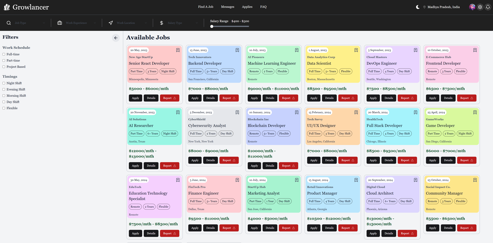

# **Growlancer - A freelancers dream come true**

## **Overview**
Growlancer is an interactive job listing platform that allows users to explore job opportunities, apply to listings, and filter jobs based on various criteria. It also features a chat functionality to help connect job seekers and employers.

---

## **Features**
- **Job Listing**: Displays available jobs with details like job title, company, location, salary, and experience requirements.
- **Search & Filters**: Users can filter jobs based on various criteria like job type, experience, salary range, and location.
- **Job Application**: Users can apply for jobs and track their application status.
- **Real-Time Messaging**: A messaging feature that allows job seekers to communicate with potential employers directly on the platform.

---

## **Technologies Used**
- **Frontend**: React.js, Tailwind CSS, Redux, TypeScript
- **UI Components**: Tailwind CSS (for styling), ShadCN UI (for buttons, select dropdowns, etc.)

---

## **Installation**

### 1. **Clone the Repository**
Clone the repository to your local machine:
```bash
git clone https://github.com/Lucky6400/growlancers-fe.git
cd growlancers-fe
```

### 2. **Install Dependencies**
Run the following command to install required dependencies:
```bash
npm install
```

### 3. **Run the Development Server**
Once dependencies are installed, run the following command to start the development server:
```bash
npm run dev
```
This will run the app on `http://localhost:5173`.

---

## **Components**

### 1. **JobSection**


The `JobSection` component is responsible for displaying the list of job cards. It allows users to filter and search for jobs based on their preferences.

- **Props**: 
  - `title`: Title of the section (e.g., "Available Jobs")
  - `applies`: Boolean to show applied jobs (true/false)

- **Features**:
  - Filter jobs by experience, salary, and location.
  - Reset filters to show all jobs.

---

### 2. **JobCard**
The `JobCard` component displays individual job details such as job title, company name, salary, and location. It also provides a button to apply for the job.

- **Props**:
  - `date`: Date of the job posting
  - `company`: Company name
  - `position`: Job position
  - `tags`: Tags associated with the job
  - `location`: Job location
  - `salary`: Salary offered
  - `jobId`: Unique identifier for the job
  - `color`: Visual design element related to the job
  - `isApplied`: Whether the user has applied for the job or not

---

### 3. **MessageList**

The `MessageList` component is responsible for displaying the list of messages from employers. It allows users to click on a message to view the details and mark the message as read.

- **Props**:
  - None (uses Redux state for managing current message)

- **Features**:
  - Displays message previews with the sender's name and last message.
  - Marks messages as read when clicked.

---

### 4. **MessageDetails**
The `MessageDetails` component displays the full conversation of the selected message. It also allows users to send new messages within the conversation.

- **Props**:
  - None (uses Redux state for managing current message)

- **Features**:
  - Displays all messages in the conversation (incoming and outgoing).
  - Send new messages.

---

## **Redux State Management**
The app uses Redux to manage the state of job listings, filter options, and message interactions. Here are the main actions:

- **Job Filtering**: 
  - Filters based on job type, work experience, location, and salary range.
  - Reset all filters to display all jobs.

- **Messages**:
  - `setUser`: Set the current message to display.
  - `setMessageRead`: Mark the selected message as read.
  - `setMessages`: Initialize the messages list in Redux store.

---

## **Styling**

The app uses **Tailwind CSS** for styling. Here's an example of the classes used in the components:

- `bg-blue-200`, `bg-white`: Background colors for elements.
- `text-gray-500`, `text-black`: Text colors.
- `flex`, `items-center`, `justify-between`: Flexbox utilities for layout.
- `rounded-xl`, `cursor-pointer`: Border-radius and cursor styles for clickable elements.

---

## **Future Improvements**
- **User Authentication**: Implement user authentication using OAuth, JWT, or Firebase to allow users to sign in and apply for jobs.
- **Admin Dashboard**: Create a dashboard for employers to post jobs, view applicants, and manage messages.
- **Job Application Tracking**: Allow users to track the status of their job applications (e.g., "Pending," "Accepted," "Rejected").
- **Search Functionality**: Add a full-text search feature to search jobs by keywords in job titles, descriptions, etc.

---

## **Contact**
For any inquiries or support, please contact the project maintainer at:

- Lucky Jain: [luckyjain7247@gmail.com](mailto:luckyjain7247@gmail.com)
- Ankita Singh: [trickynest1220@gmail.com](mailto:trickynest1220@gmail.com)

---
